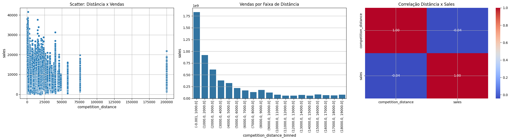
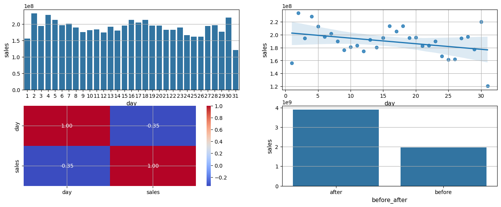
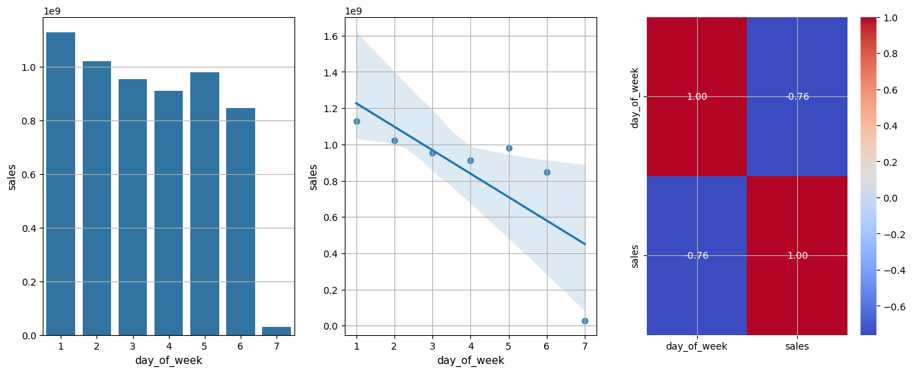
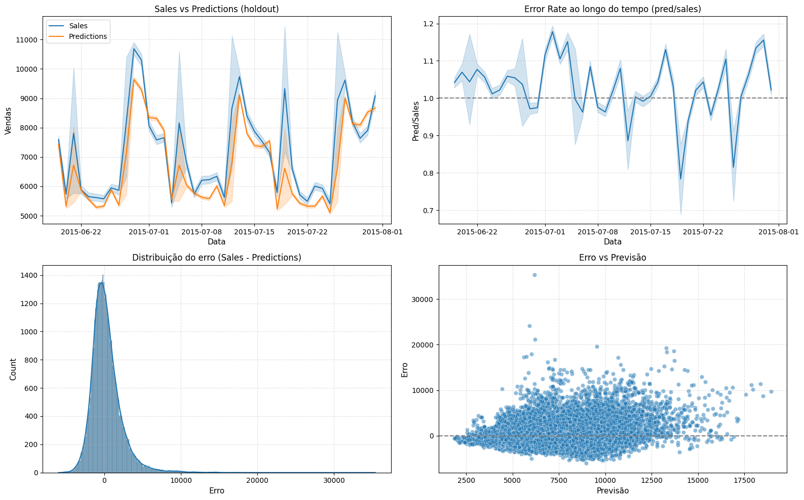

**📊 Rossmann Store Sales Prediction**

 

**🔰 Problema de Negócio**

O **CFO da Rossmann** solicitou aos gerentes de loja previsões de vendas para as **próximas 6 semanas**, de modo a **planejar reformas e operações** com base no faturamento esperado.

**Objetivo**: Desenvolver um modelo de Machine Learning capaz de prever **vendas diárias por loja**, de forma escalável, confiável e com impacto direto na tomada de decisão do negócio.

**🧭 Metodologia**

O projeto segue a metodologia **CRISP-DS (Cross-Industry Standard Process for Data Science)**:

1. **Entendimento do negócio**

2. **Coleta e tratamento dos dados**

3. **Feature Engineering** (variáveis temporais, competidores, promoções, sazonalidade)

4. **Análise Exploratória (EDA)** e validação de hipóteses de negócio

5. **Seleção de variáveis** (Boruta, Permutation Importance, Mutual Info)

6. **Modelagem e avaliação** (XGBoost, Random Forest, Regressões lineares como baseline)

7. **Fine Tuning de hiperparâmetros** (Random Search)

8. **Interpretação executiva** (impacto financeiro das previsões)

**📂 Estrutura do Projeto**

```text
rossmann-store-sales/
│
├── data/                <- Dados brutos (train.csv, store.csv)
├── notebooks/           <- Jupyter Notebooks (rossmann_notebook.ipynb)
├── models/              <- Modelos treinados
├── artifacts/           <- Gráficos e resultados
├── README.md            <- Este arquivo
```

**🔎 Feature Engineering**

As principais variáveis derivadas incluem:

* **Calendário**: year, month, day, week_of_year

* **Concorrência**: competition_time_month, competition_distance_log

* **Promoções**: promo_time_week, is_promo

* **Sazonalidade** (Fourier): transformações sen/cos para day, month, week

* **Codificação categórica**: state_holiday, store_type, assortment

**📊 EDA & Validação de Hipóteses**

Foram testadas 12 hipóteses de negócio.
Exemplos:

* **H2**: “Lojas com competidores mais próximos deveriam vender menos” → **Falsa** (essas lojas vendem mais).
 

* **H10**: “Lojas deveriam vender mais depois do dia 10 de cada mês” → **Verdadeira**.


* **H11**: “Lojas deveriam vender menos aos finais de semana” → **Verdadeira**.


Essa etapa trouxe **insights para o negócio** e **direcionou as features do modelo**.

**🤖 Modelagem**

Modelos testados:

* **Baseline**: Média móvel, Regressão Linear, Lasso

* **Avançados**: Random Forest, XGBoost

**Avaliação (Cross Validation + Teste Temporal)**
| Modelo              | MAE     | MAPE     | RMSE    | R²       |
| ------------------- | ------- | -------- | ------- | -------- |
| Linear Regression   | 1200    | 18.5%    | 1800    | 0.72     |
| Random Forest       | 900     | 13.0%    | 1500    | 0.85     |
| **XGBoost (tuned)** | **457** | **6.9%** | **683** | **0.95** |

👉 O **XGBoost** foi escolhido como modelo final.

**⚙️ Fine Tuning**

Realizado com **Random Search**, explorando hiperparâmetros:

```text
n_estimators: [1500, 3500]

eta: [0.01, 0.03]

max_depth: [3, 9]

subsample: [0.1, 0.7]

colsample_bytree: [0.3, 0.9]

min_child_weight: [3, 15]
```

🔹 **Melhor configuração encontrada**:
```text
param_tuned = {
    'n_estimators': 3000,
    'eta': 0.03,
    'max_depth': 9,
    'subsample': 0.5,
    'colsample_bytree': 0.7,
    'min_child_weight': 8
}
```

**💰 Interpretação Executiva**
**Performance Global (em R$)**
| Cenário        | Valor Estimado |
| -------------- | -------------- |
| Previsto       | R\$ 2.15 Bi    |
| Pior Cenário   | R\$ 2.10 Bi    |
| Melhor Cenário | R\$ 2.20 Bi    |

* **Erro médio por loja (MAE)**: ~R$ 457 mil/dia

* **Erro percentual médio (MAPE)**: ~6.9%

**Gráfico de performance do modelo**


**🚀 Como Rodar**

1. Clone o repositório:
*git clone https://github.com/Brunoclf19/rossmann-store-sales*

2. Instale as dependências
*pip install -r requirements.txt*

3. Execute o notebook
*jupyter notebook notebooks/rossmann_notebook.ipynb*

## 🚀 Deploy e Demonstração

O modelo final foi colocado em **produção** por meio de uma **API desenvolvida em FastAPI**, integrada a um **bot no Telegram**.  

📌 Funcionamento:
1. O usuário envia um comando no Telegram para prever o faturamento nos próximos 6 meses (ex.: `12`).
2. O bot consulta a **API em tempo real**.
3. A previsão de vendas para as próximas 6 semanas é retornada diretamente na conversa.

🔗 **Demonstração em Vídeo:**  
[▶️ Clique aqui para assistir](artifacts/bot_funcionamento.mp4)

**📌 Próximos Passos**

* Inclusão de dados externos (feriados regionais, clima, macroeconômicos).

* Monitoramento contínuo do modelo em produção.

✍️ Autor: Bruno Freitas

🔗 Projeto baseado no curso DS em Produção da [Comunidade DS](https://comunidadeds.com/)
